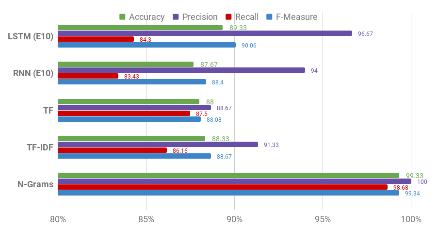

<!-- 
Report:
Write a report to describe and justify your solutions and the design choices you have made at every step.

In particular:
1. justify the features used in A2. (  2. Use NLP techniques to extract numerical features that you could use to build a classifier. This may include: tf, tf-idf, N-grams. (5 marks))
2. What is your conclusion of the comparison among the models in B2. (  2.  Compare the classification results using the different features you extracted in the previous step. Use the classification accuracy, Precision, Recall, and F1-measure as comparison metrics.(5 Marks))
3. Provide rationale for the architecture of your deep learning models and the choice of activation functions

Describe your conclusion of the use of the two approaches and discuss which approach you think is fit for purpose. Be creative in presenting the results in a clear and understandable format. Write a maximum of 2000 words. Figures and tables are excluded from the word count.(20 Marks)

Additional Assessment Criteria:
A.General Performance of the solution on the test data set
-Are the results comparable or above the expected baseline (i.e. > 75% accuracy)? (10 Marks)
-How all the components work together to achieve the reported results (10 Marks)

Submission: 
1. Sourcecode for both your shallow and deep solutions
2. Report,maximum of 2000 words
3. Clarify what libraries you have used and any specific installation instructions if applicable. 4. CODE THAT DOES NOT RUN WILL LOSE ITS FULL ALLOCATED MARK.
''' -->

# Program Prerequisites
The python program utilises the `numpy`, `keras` and `nltk` libraries. `keras` by default installs `tensorflow`, but it is recommended to install tensorflow manually to optimise its performance. The manual installation compiles the program based on the machine, allowing it to utilise certain processor specific instruction sets. However, installing via `pip` or `conda` will also suffice. The submitted program will attempt to download the GloVe dataset itself. (It cannot however, show a loading bar but it will verify the integrity of the file.)

    pip3 install numpy nltk tensorflow keras
    python3 main.py

# Testing Configuration

For the sake of consistency, both learning techniques are subject to a machine utilising an `intel i7-6600u` with 12 Gigabytes of DD4 memory, alongside NVM-E storage. Due to the relatively large nature of the word2vec dataset which will be used, running times may vary dependent the hardware utilised such as the storage, memory and the processor itself. 

# Data Sanitisation

Each document's article is converted into lowercase and is then subject to the ordered removal of:

- Strong quotation marks (“ and ”)
- Commas between numbers
- Apostrophes between letters, alongside the suffix (which indicate plurality, posessive cases or contrations)
- URLs
- Line breaks
- Unicode strings
- Duplicate quotes
- Punctuation
- Stopwords

The removal is ordered as removing punctuation hollistically in one round has shown to produce unintended effects, i.e `20,000,000 => 20 000 000` or `John Lennon's => john lennon s`.

The reasoning behind the removal of stopwords is related to the fact that the words themselves are used for grammatical understanding, which are not considered in our learning methods, especially in the case for shallow learning. 

Lemmatisation and word stemming was not used as it was found to produce marginal increases in performance for both learning methods. Given that this particular process takes a considerable amount of time during sanitisation, it did not justify the marginal returns.

Once sanisation was complete, a dataset object is created, containing each document in the dataset. Each document is an object itself, containing the raw article, and the cleaned data, (now a list of words in python). The object is saved locally to reduce loading times upon the next launch.

The documents are split such that there is 300 documents (150 fake, 150 real) which are used as test data and the rest is used as training data. This allocation allows for plentiful training data, and having an equal amount of the two datasets helps to add weighting to the accuracy scores during evaluation. It also helps that the training set is also well balanced, i.e out of the 6331 entries scraped in the dataset, 3164 are fake and 3171 are real. For the deep learning methods, validation data consists of a further 300 documents (containing equal amounts of each class) from the training data. They are not used during training. Traditionally, a more equal divison of the datasets is preferred (i.e 3:1) but a larger training data was chosen to test the limits of the classifiers.

# Shallow Learning

Whilst there exist a variety of packages that may facilitate the shallow learning process, I have chosen to implement most of them manually to help understand the inner workings of how shallow learning techniques work. There is naturally a tradeoff however. For instance, the implementation I may have used might be not as efficent as the libraries.

## Term Frequency

Each document is iterated, with each word being counted relative to the rest of the other words in the document. This is then stored in the document's object in a dictionary, where each word is a key, and their word count is the value. 

## Term-Frequency/Inverse Document Frequency

A global document frequency $\mu$ for words is introduced, using the training documents's words. For each document, we iterate through its term frequency and accumulate them to $\mu$. This ensures that each unique word is counted per document as opposed to their word-count/term-frequency. Once this is accumulated, Each document is iterated through and a TF-IDF value is calculated for each word $w$ using the formula $tfidf(w) = tf(w) * df(w)^{-1}$. TF-IDF values are stored in the same style as how term-frequency is stored in a document's object.

## N-Grams

There is the option to use either bigrams or trigrams (unigrams can be considered equivalent to term-frequency), when using the n-grams option. Using the `NLTK` library,
N-Grams are produced, using the document's cleaned word-list and are stored in the document's object.

      trigrams([the quick brown fox jumped over the lazy dog])

        (the quick brown)
        (quick brown fox)
        (brown fox jumped)
        ...
        (the lazy dog)

## Naive Bayes Classifier

Words (or n-grams) found in the test document that are not in the training document are **ignored.** This is chosen to reinforce the utility of the training data. With $\alpha$ as the conditional probability of a word or a wordgroup for a given class, $\epsilon$ being the class itself, the naive bayes classifier is composed of the formula:

$$\beta = (count(\alpha,\epsilon) + 1) / (count(\epsilon) + vocabulary)$$
$$ P(X|Y) =  \beta \cdot \gamma $$

Where $\gamma$ represents the probability of a class. For the n-grams model, they are treated in the same vein as term-frequency; for instance we collate the frequency of a particular n-gram to calculate their conditional probability. For TF-IDF, we substitute the term frequency with their TF-IDF value.

This formula is used on each of the classes (fake and real), and the class is chosen based on whether its probability is higher than the other.

# Deep Learning

For deep learning, we subject each document using the glove word2vec model (which can be found [at https://nlp.stanford.edu/projects/glove/](https://nlp.stanford.edu/projects/glove/)) as the base to compare the documents against. 

Four different activation functions are tested to maximise the performance of both the LSTM and the regular recurrent neural network, Linear, ReLu, Sigmoid, and tanh. Whilst Linear and ReLu are quite similar, they all provide different ranges.

Sigmoid is used as our activation function. This is a natural decision as its range (from 0 to 1 inclusive) fits well with the probability ranges needed to determine the two classes.

The vanishing gradient isn't necessarily a big issue due to the number of layers involved (which is not enough to justify the use of linear activation functions such as ReLu, as shown in our results).

Otherwise, the structure for both LSTM (Via `keras.layers.LSTM`) and the RNN (Via `keras.layers.simpleRNN`) models remain the same. A binary entropy loss function is used to reduce the chances of overfitting the training data. Root Mean Square propagation is chosen due to its suitability to  adapt the learning rate for each of the parameters. This goes in hand with the training data, as it has varying article sizes (which could be either very short or extensibly long.) Dropout layers have been considered, as they can also help reduce the chances of overfitting of the data, but it was found to reduce the overall performance of the classifier. This may be due to the small number of epochs.

An embedding layer is used to interpret the word2vec indexes (which are used as the input values) to a vector in the embedding matrix. The GloVe data is used as input, and we also test the model with a random matrix. This allows us to utilise a continuous, distributed representation of the words, such that words of some similarity are mapped within similar regions. 

During testing, there may be the case where words that are in the test set may not exist in the training data or in the glove dataset. In this situation, we create a new vector that utilises the mean of the vectors of the first 1000 glove words. (Note that the glove dataset is ordered in terms of word frequency, so the most popular words appear first, and so on.) This is to help create a fair comparison between the shallow and deep learning methods. Naturally, sentence padding utilises a zero vector.

Training was performed with 10 epochs, and was repeated 10 times to deduce an average. The outputs of the neural network is rounded to the nearest integer to indicate a class it has guessed, given an input document.

# Results
<!--
Additional Assessment Criteria:
A.General Performance of the solution on the test data set
-Are the results comparable or above the expected baseline (i.e. > 75% accuracy)? (10 Marks)
-How all the components work together to achieve the reported results (10 Marks)
-->

For the sake of performance measures, only the accuracy, precision, recall and F1 scores are interpeted for both classification methods.

## Shallow 

<!-- tf:	 {'tp': 44.33, 'fp': 6.33, 'fn': 5.67, 'tn': 43.67, 'accuracy': 88.0, 'precision': 88.67, 'recall': 87.5, 'f1_measure': 88.08}
tfidf:	 {'tp': 45.67, 'fp': 7.33, 'fn': 4.33, 'tn': 42.67, 'accuracy': 88.33, 'precision': 91.33, 'recall': 86.16, 'f1_measure': 88.67}
ngrams:	 {'tp': 50.0, 'fp': 0.67, 'fn': 0.0, 'tn': 49.33, 'accuracy': 99.33, 'precision': 100.0, 'recall': 98.68, 'f1_measure': 99.34}
 -->

| Method   | Precision | Accuracy | Recall | F1 Measure | Time Taken |
|----------|-----------|----------|--------|------------|------------|
| TF       | 88.67     | 88.00    | 87.50  | 88.08      | Negligible |
| TF-IDF   | 91.33     | 88.33    | 86.16  | 88.67      | Negligible |
| Bigrams  | 100.0     | 99.33    | 98.68  | 99.34      | Negligible |
| Trigrams | 100.0     | 99.33    | 98.68  | 99.34      | Negligible |

<!-- 
In simple terms, high precision means that an algorithm returned substantially more relevant results than irrelevant ones, while high recall means that an algorithm returned most of the relevant results.

The F1 score is the harmonic average of the precision and recall, where an F1 score reaches its best value at 1 (perfect precision and recall) and worst at 0.
-->

## Deep

### Random Weights

<!-- 
fixed measures:
LSTM (With Weights ND): {'tp': 38.67, 'fp': 4.0, 'fn': 11.33, 'tn': 46.0, 'accuracy': 84.67, 'precision': 77.33, 'recall': 90.62, 'f1_measure': 83.45}
RNN (With Weights ND):  {'tp': 48.67, 'fp': 24.33, 'fn': 1.33, 'tn': 25.67, 'accuracy': 74.33, 'precision': 97.33, 'recall': 66.67, 'f1_measure': 79.13} -->

| Method    | Precision | Accuracy | Recall | F1 Measure | Time Taken (Per Epoch) |
|-----------|-----------|----------|--------|------------|------------|
| LSTM (E1) | 77.33     |  84.67, |  90.62 |  83.45    |     55s    |
| RNN (E1)  | 97.33  | 74.33    |   66.67|  79.13     |     18s    |
| LSTM (E10) |  96.67  | 89.33  | 84.3 | 90.06    | 55s        |
| RNN (E10)  | 94.0    | 87.67  | 83.43  | 88.4      | 23s        |

<!-- 
10 epochs (no weights) fixed measures:
LSTM:	 {'tp': 48.33, 'fp': 9.0, 'fn': 1.67, 'tn': 41.0, 'accuracy': 89.33, 'precision': 96.67, 'recall': 84.3, 'f1_measure': 90.06}
RNN:	 {'tp': 47.0, 'fp': 9.33, 'fn': 3.0, 'tn': 40.67, 'accuracy': 87.67, 'precision': 94.0, 'recall': 83.43, 'f1_measure': 88.4} -->

### With Weights

| Method    | Precision | Accuracy | Recall | F1 Measure | Time Taken (Per Epoch) |
|-----------|-----------|----------|--------|------------|------------|
| LSTM (E1) |  72.0     | 75.33    | 77.14  | 74.48     | 62s        |
| RNN (E1)  | 71.33     | 72.67    | 73.29  | 72.30     | 20s        |
| LSTM (E10) | 94.67    | 85.33   |  79.78 | 86.59    |  55s  |
| RNN (E10)  |  84.67   | 80.0   | 77.44 | 80.89     |    23s    |

An interesting fact is that the inclusion of the word2vec weights reduces the  performance of the LSTM and CNN. This may be due to the fact that words that are not considered in the glove dataset have a weighting of 0 and may spoil the propagation of values on a recurrent neural network. It may also relate to the fact that popular words are indexed with a lower value, i.e. less common words will have an higher index. As we are feeding the indexes of the words into Keras, it would take that into account (notwithstanding the weights). 

<!-- A first step is to understand the types of errors our model makes, and which kind of errors are least desirable. In our example, false positives are classifying an irrelevant tweet as a disaster, and false negatives are classifying a disaster as an irrelevant tweet. If the priority is to react to every potential event, we would want to lower our false negatives. If we are constrained in resources however, we might prioritize a lower false positive rate to reduce false alarms. A good way to visualize this information is using a Confusion Matrix, which compares the predictions our model makes with the true label. Ideally, the matrix would be a diagonal line from top left to bottom right (our predictions match the truth perfectly).

Our classifier creates more false negatives than false positives (proportionally). In other words, our model’s most common error is inaccurately classifying disasters as irrelevant. If false positives represent a high cost for law enforcement, this could be a good bias for our classifier to have. -->

<!-- https://www.instapaper.com/read/1009550406 -->

The deep learning methods reach a higher precision ratio compared to their recall, but with the shallow methods, we can see that they have higher level of recall than their precision. Taking the F1-Measure of all classification methods, we can see that, barring the n-grams, Deep learning methods perform the strongest out of the two learning methods. LSTM performs the best out of the group. However, to reach this level of accuracy, it takes an considerably larger amount of computation to reach.

# Conclusion

In terms of shallow feature extraction, both TF and TF-IDF performed considerably well. Naive-Bayes is a strong generative classifier, and is commonly defined using TF as the premise, and we can see that it is sufficent to provide a high degree of accuracy. That being said, the use of n-grams has shown to perform to a near-perfect accuracy, but it cannot be recommended as the data is difficult to interpret. 

Interestingly, the performance difference between TF and TF-IDF is within margin of error. This may be related to the fact that words that may be considered significant on the test set might not be in the training data. This can also explain why TF has a higher recall score i.e. it returns more relevant results than TF-IDF, and that the precision score of TF-IDF is especially high compared to the other methods. Surprisingly, the n-grams method performs strongest. This should be taken with a grain of salt, as it may be the case that the use of n-grams would be too sparse, given the size of the dataset.

Both Naive-Bayes and Recurrent Neural Networks are strong contemporary methods in classification problems. They are however, very different methods of solving the same task. This disparity is represented through the inherent tradeoffs between the two. Naive-Bayes runs in a fraction of the time compared to Recurrent Neural Networks, and from our training data the immediate run shows naive bayes performing better overall on one epoch compared to our deep learning models. RNNs however, show an considerably higher level of precision, as shown in our measurements.

RNN's are naturally sequential, and for words that do not exist in the training data, we can see this may have had an impact in our results. 

It can be argued that the dataset is not large enough to justify the use of deep learning methods. A strong performance can be seen for the shallow learning methods (tf, n-grams) in the fraction of the time of the deep learning methods. Within the immediate context, this would suffice.
<!-- 
One could further the performance of both classifiers by either feeding the test data into the training dataset, and, in the case for RNNs, we could increase the epochs (the runtime over the dataset). This would 

In the case of the deep learning methods; another method is proposed where an average vector is produced per sentence, and we classify sentence vectors instead. 
This may however fare much better for a larger word2vec dataset. Presently, the glove dataset used has a vector size of 50, but 300 is more common (as is the case for google's and SpaCy's.) -->
<!-- 
Describe your conclusion of the use of the two approaches and discuss which approach you think is fit for purpose. Be creative in presenting the results in a clear and understandable format. Write a maximum of 2000 words. Figures and tables are excluded from the word count.(20 Marks)
-->